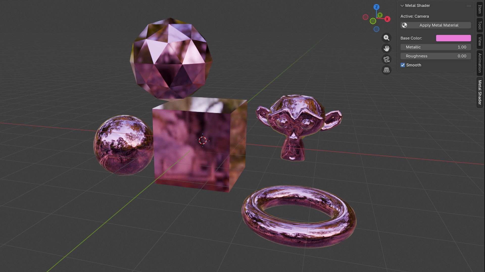
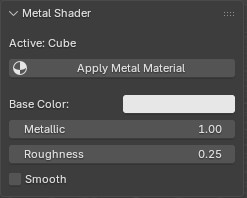
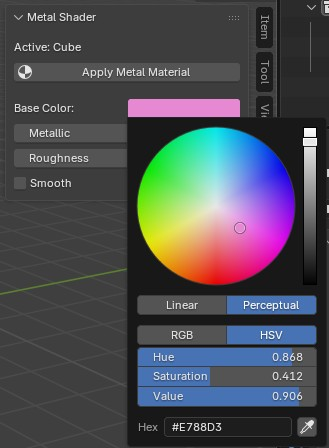
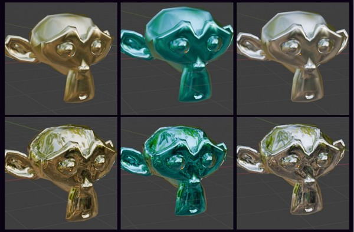
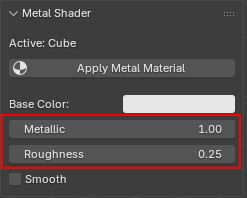
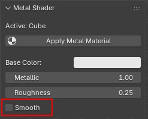
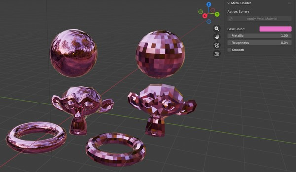
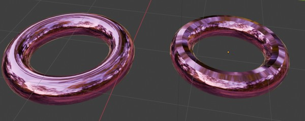
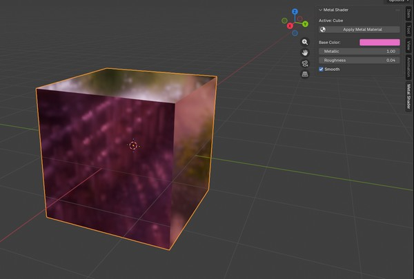

# 3D: METALLIC SHADER

Vykreslení kovového materiálu na objekty.

Plugin je psán v jazyce Python pro software Blender.




## Uživatelská dokumentace

Níže je popsáno, jak plugin instalovat a správně používat.

### Import

Import pluginu probíhá skrze `Edit` > `Preferences` > `Get Extensions` > Vrchní šipka vpravo směřující dolů > `Install from Disk...` > Vklad cesty/zip (ze src/plugin.zip) projektu.

Pokud není Blender aktualizován okamžitě, je možné po kliknutí na logo Blenderu v levém horním rohu zvolit `System` > `Reload Scripts`.

### Spuštění

Plugin se nachází pod jménem `Metal Shader` v bočním výběru, pokud není viditelný, lze jej zobrazit stiskem šipky na boku.


### Ovládání

K tomu, aby mohl být plugin aktivován, je nutné vybrat objekt.

Následně se otevře panel s nastavením pro aplikaci shaderu.



Defaultní barvou je bílá, lze však experimentovat s voličem barev a dalšími odstíny pomocí color pickeru. Níže je vyobrazena ukázka voliče barev a výsledky s nastavením různých barev při nastavení metallic = 1 a roughness = 0.25, v druhém případě metallic = 1 a roughness = 0.





Plugin podporuje také přizpůsobení parametrů `metallic` s `roughness` s real-time ukázkou. 
- Metallic rozsah: 0-1
- Roughness rozsah: 0-1



Je možné označit i zrušit "Smooth" okénko, které vyhladí povrch objektu nebo jej vrátí zpět do původního stavu. V následující ukázce je vyznačena ukázka na panelu a tři stejné objekty, jedna sada (vlevo) vyznačená jako "smooth", druhá sada (vpravo) bez tohoto nastavení.






## Teoretická a programátorská dokumentace

V Blenderu je materiál definován jako síť uzlů (node tree), které popisují chování povrchu objektu vůči světlu. Každý materiál má:

- Node Tree – graf uzlů
- Material Output – výstupní uzel, který je napojen na renderovací engine
- Shader uzly – definují optické vlastnosti povrchu

Plugin pracuje výhradně s uzlovým systémem (use_nodes = ture).

### Principled BSDF

"BSDF je Bidirectional scattering distribution function, v češtině
obousměrná rozptylová distribuční funkce. Je to matematická funkce, která
určuje, jak se paprsky světla odrazí od povrchu pod daným
úhlem. Principled BSDF je shader, který je složený z více
nastavení nebo shaderů."
(Zdroj definice: https://www.itnetwork.cz/blender/textury/add-on-node-wrangler-a-nody-bsdf-v-blenderu)

Principled BSDF v Blenderu vychází z Disney PBR modelu a je standardem pro realistické materiály.

**Klíčové parametry:**

1. Využité v pluginu:
- Base Color: Základní barva povrchu
- Metallic: Určuje chování povrchu jako kov, rozsah 0-1
- Roughness: Míra rozptylu odrazu - čím nižší, tím je odraz na povrchu více viditelný, rozsah 0-1

2. Nevyužité v pluginu:
- IOR: Index lomu (IOR) pro zrcadlový odraz a propustnost. Výchozí hodnota: 1,5 - přibližuje se materiálu skla. Pro naše účely nevytváří zásadní změny, proto nebyl využit.
- Alpha: Ovládá průhlednost povrchu, výchozí hodnota: 1 znamená úplnou neprůhlednost. Kovy jsou neprůhledné, proto nebyl parametr využit.

### Shading
Smooth shading je technika interpolace normál mezi vrcholy, která vizuálně vyhlazuje povrch bez změny geometrie.

Plugin implementuje:

- shade_flat – zachování ostrých hran

- shade_smooth – plné vyhlazení

- shade_auto_smooth – kombinace obou metod podle úhlu/komplexity

Rozhodnutí je založeno na počtu hran objektu:

méně hran (počet <= 48): shade_auto_smooth

více hran (počet > 48 ): shade_smooth

Volba vyhlazení byla založena na problůmu s objektem Torus, který v případě auto shadingu vytvářel nedokonalý výsledek. Volba se osvědčila i u ostatních materiálů. Níže je vyobrazen příklad objektu Torus při zapnutém shade_smooth (vlevo) a shade_auto_smooth (vpravo).



Veškerá logika se nachází v souboru `__init__.py`.

K implementaci byl využit import `bpy`. Tento balíček poskytuje Blender jako modul Pythonu pro použití ve studiových procesech, webových službách, vědeckém výzkumu a dalších oblastech.

Principled BSDF využíváme v našem pluginu díky shader ShaderNodesBsdfPrincipled:
```
bsdf = nodes.get("Principled BSDF")
    if bsdf is None:
        bsdf = nodes.new("ShaderNodeBsdfPrincipled")
```

### Nastavení parametrů

Pro plugin bylo zvoleno takové nastavení parametrů

- Base color: #FFFFFF
- Metallic: 1 - V případě 0 se objekt nejeví jako metalický, proto je základní hodnota nastavena na nejvyšší.
- Roughness: 0.25 - Příliš vysoká hodnota nevytváří reflexi. Hodnota na 0 plně odráží okolí, byla zvolena hodnota, která působí realisticky pro kovy, a zároveň neodráží plně okolní prostředí.
- Smooth: False

Materiál se nikdy nevytváří duplicitně, znovu jej využívá, inicializuje uzly pouze, pokud neexistují.

### Ukázky

Ovládací panel je jednoduchý, nepovoluje uživateli aktivovat plugin, pokud není vybrán objekt.

 ```
class VIEW3D_click_metal(bpy.types.Panel):
    bl_space_type = "VIEW_3D"
    bl_region_type = "UI"
    bl_category = "Metal Shader"
    bl_label = "Metal Shader"

    @classmethod
    def poll(cls, context):
        # Only show when an object is selected/active
        return context.mode == "OBJECT" and context.active_object is not None

    def draw(self, context):
        layout = self.layout
        obj = context.active_object

        layout.label(text=f"Active: {obj.name}")

        layout.operator("object.apply_metal_material", icon="MATERIAL")

        layout.separator()
        s = context.scene.click_metal_settings
        layout.prop(s, "base_color")
        layout.prop(s, "metallic")
        layout.prop(s, "roughness")
        layout.prop(s, "enable_smooth")
 ```

Pro aplikování materiálu slouží metoda execute v  `apply_metal_material`:
```
    def execute(self, context):
        mat = ensure_metal_material("Metal")

        # Apply current UI settings to the material
        update_metal_settings(None, context)

        # Assign to all selected relevant objects
        for obj in context.selected_objects:
            if obj.type in {"MESH", "CURVE", "SURFACE", "META", "FONT"} and hasattr(obj.data, "materials"):
                get_or_add_material_slot(obj, mat)
            
            if obj.type == "MESH":
                # If smooth enabled, for better results counting number of edges
                if context.scene.click_metal_settings.enable_smooth:
                    if len(obj.data.edges) <= 48:
                        bpy.ops.object.shade_auto_smooth()
                    else:
                        bpy.ops.object.shade_smooth()
                else:
                    bpy.ops.object.shade_flat()

        return {"FINISHED"}
```
Ukázka objektu po použití pluginu:


