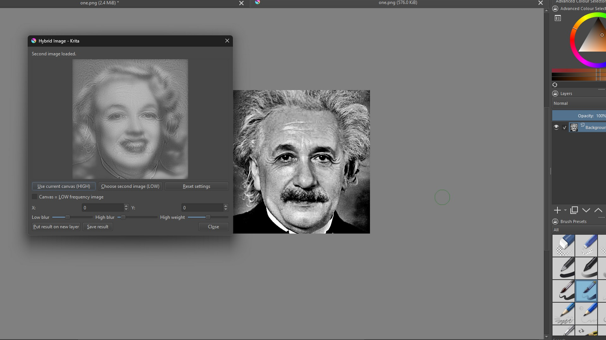
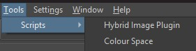
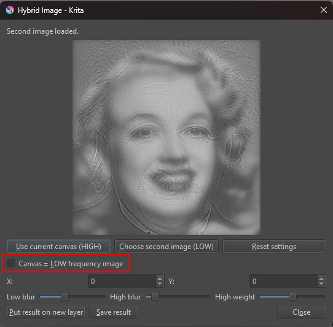
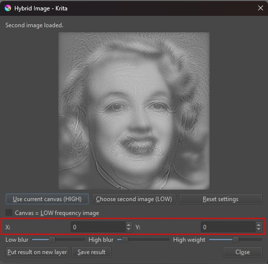
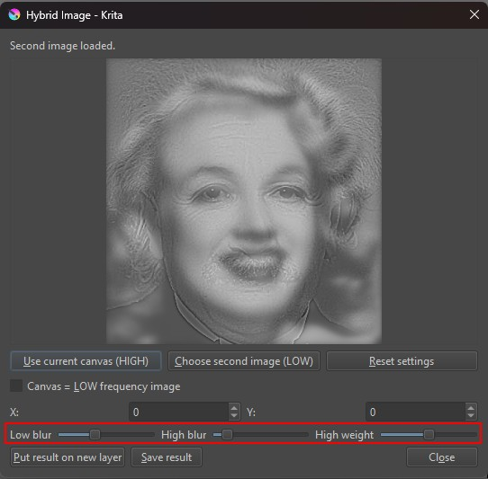
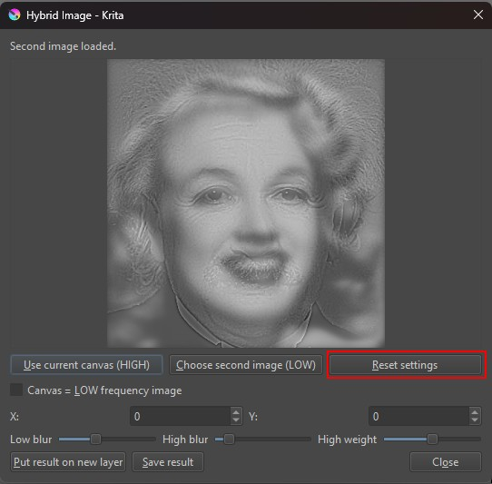
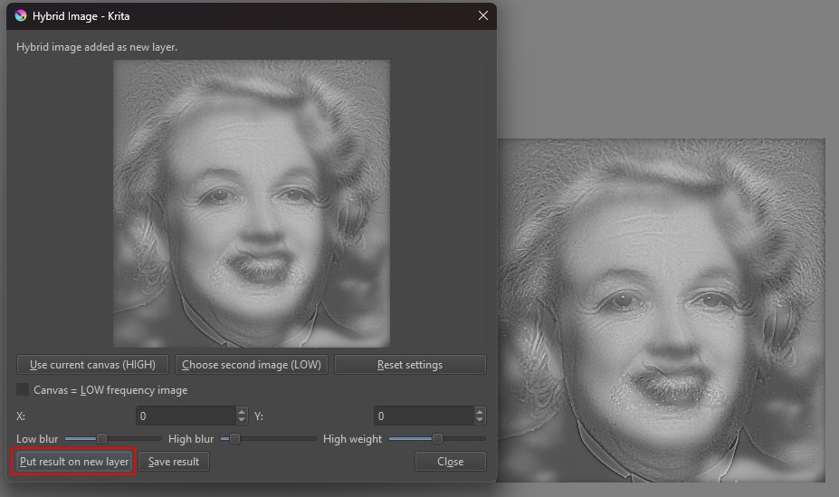
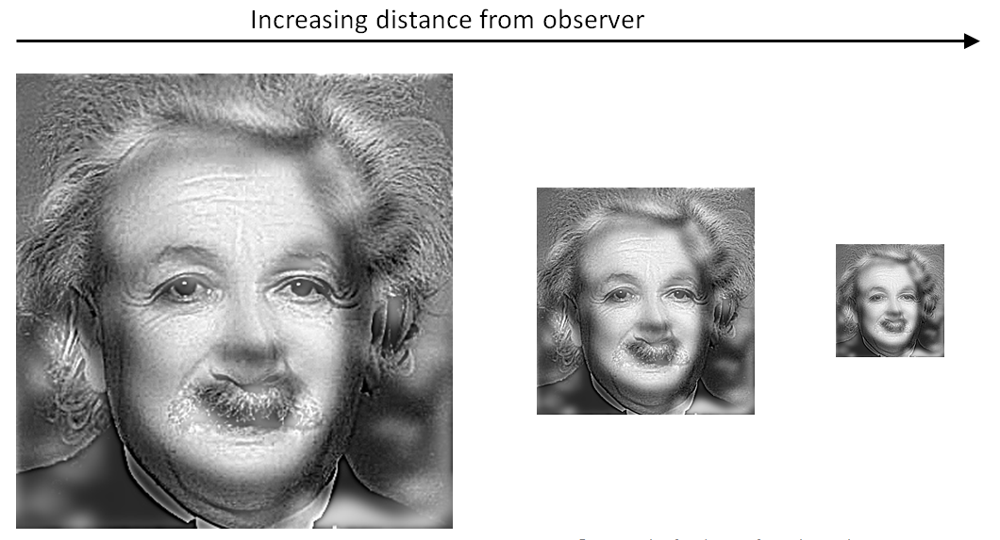
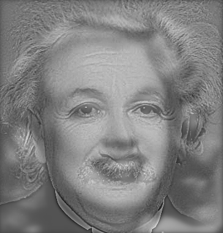
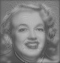

# 2D: HYBRID IMAGES PLUGIN

Vytvoření pluginu do softwaru Krita vytvářející tzv. "Hybrid Images".
Při pohledu na objekty v blízkosti, zobrazují se jemné detaily (tj. dominují vyšší prostorové frekvence).
Při pohledu na objekty v dálce má větší vliv široký obrys (tj. dominují nižší prostorové frekvence).

Plugin je psán v jazyce Python a byl spouštěn na systému Windows.





## Uživatelská dokumentace

Níže je popsáno, jak plugin instalovat a správně používat.

### Import

Návod, jak přidat plugin do programu Krita se nachází zde: https://docs.krita.org/en/user_manual/python_scripting/krita_python_plugin_howto.html

Je nutné stáhnout celou složku `src` včetně souborů `__init__.py` a `.desktop`

### Spuštění

Po importu spustíme program Krita. Přejdeme do `Settings` -> `Configure Krita` -> `Python Plugin Management`
V seznamu by se měl nacházet náš plugin pod jménem `HybridImagesPlugin`. Zvolíme jej a restartujeme program.

Po spuštění by se měl nacházet plugin v `Tools` -> `Scripts` -> `Hybrid Image Plugin`



### Ovládání

Je nutné nejprve načíst fotografii. Po načtení je možné rovnou spustit plugin.

Po načtení obrazovky je třeba načíst druhou fotografii po spuštění náhledu.


Pomocí checkboxu lze přepínat mezi tím, který obrázek bude LOW a který HIGH. 



Pomocí X a Y voleb je možné obrázek přizpůsobit plátnu.



Posuvníky umožňují úpravu nastavení a fúzi fotografií. 



Veškeré změny v nastavení lze zrušit tlačítkem Reset.



Po stisknutí "Put result on new layer je vytvořena nová vrstva s výsledným hybridním obrazem




## Teoretická dokumentace

### Princip hybridních obrazů

Hybridní obraz (Hybrid Image) je speciální typ sloučeného obrazu využívající vlastnosti lidského zrakového vnímání. Lidský vizuální systém reaguje rozdílně 
na různé prostorové frekvence v závislosti na vzdálenosti pozorovatele od objektu:

Při **krátké pozorovací vzdálenosti** dominují vysoké prostorové frekvence, tedy jemné detaily, hrany a textury.

S **velkou pozorovací vzdáleností** začínají naopak dominovat nízké prostorové frekvence, silueta, obrys, celkový tvar.


Hybridní obraz kombinuje dvě různé fotografie tak, že:

z jedné fotografie jsou zachovány nízké frekvence (LOW),

z druhé fotografie jsou zachovány vysoké frekvence (HIGH).

Výsledkem je obraz, který se percepčně mění s pozorovací vzdáleností. Při pohledu zblízka divák vnímá jeden motiv, při pohledu z dálky jiný.

Ukázka hybridního obrazu při různých velikostech simulující zvýšenou vzdálenost pozorovatele od objektu:


Pro úspěšný výsledný hybridní obraz je důležité:
- Minimalizovat zasahování jednoho motivu do druhého
- Zarovnání klíčových prvků obou obrazů, zabrání se tak tvorbě konfliktních interpretací v obraze
- Využít barvu nejvýše v jednom frekvenčním pásmů pro zvýraznění významu a bez rušení druhého motivu

V této implementaci je proto každý z obrazů převeden do grayscale. Bude tak zajištěn nejlepší výsledek bez rušení.

**Využití**

Hybridní obrazy se používají i jako nástroj výzkumu vizuálního vnímání: studie ukazují, že pozorovatelé často ani nevědí, že viděli dva obrazové motivy, pokud jsou prezentovány jen krátce nebo z jedné perspektivy — což naznačuje, že mozek vybírá dominantní frekvenční pásmo podle úkolu, nikoli náhodou. 

Novější výzkumy také ukazují, že například konvoluční neuronové sítě (CNN) a transformery zpracovávají hybridní obrazy podobně jako lidské vizuální systémy — další důkaz o tom, že principy multiskálového zpracování obrazu jsou univerzální.

### Prostorové frekvence v obraze

Digitální obraz lze chápat jako dvourozměrný signál obsahující různé frekvenční složky:

**Nízké frekvence**
– pomalu se měnící jasové hodnoty
– odpovídají velkým plochám, tvarům a celkové kompozici

**Vysoké frekvence**
– rychlé změny jasových hodnot
– odpovídají hranám, detailům a texturám

Hybridní obraz vzniká frekvenčním filtrováním obou vstupních fotografií a jejich následnou fúzí.

### Převod na jasovou složku (luminance)

Nízkofrekvenční obraz je před rozostřením převeden do grayscale (jasové složky).

**Důvod:**

- Lidské vnímání detailů je citlivější na jas než na barvu,

- Potlačení barev u LOW složky zvyšuje stabilitu výsledného hybridního efektu.

Použit je percepční vážený převod dle standardu ITU-R BT.709:

Y = 0.2126*R+0.7152*G+0.0722*B

### Nízkofrekvenční složka (Low-pass filtr)

Nízkofrekvenční složka je získána pomocí **Gaussova rozostření** (Gaussian blur).

Gaussův filtr potlačuje vysoké frekvence a zachovává pouze hladké přechody a hlavní strukturu obrazu. Míra rozostření je řízena parametrem σ (sigma), který určuje šířku Gaussovy křivky.

V implementaci pluginu:

- parametr low_sigma určuje intenzitu rozostření,
- čím vyšší hodnota, tím více se potlačí detaily.

### Vysokofrekvenční složka (High-pass filtr)

Vysokofrekvenční složka je získána odečtením rozmazané verze obrazu od originálu.

Postup:

1. Originální obraz

2. Verze obrazu po provedení Gaussova rozostření

3. Rozdíl těchto dvou obrazů

Tímto postupem jsou odstraněny nízké frekvence a zachovány pouze detaily a hrany.
Pro zachování hodnot v platném rozsahu je ke každému pixelu přičtena konstanta (128), aby nedocházelo k záporným hodnotám.

### Výsledek

Výsledný hybridní obraz (I_h) vznikne kombinací obou složek:

I_h = I_l + a * I_h

kde:

- I_l je nízkofrekvenční obraz
- I_h je vysokofrekvenční obraz
- a je váhový koeficient (v plugin parametr high_weight)

V implementaci je tato kombinace realizována pomocí alfa-blendingu (QPainter.setOpacity()).

## Technická dokumentace

### Architektura řešení

Plugin je psán v jazyce Python s využitím:
- Krita Python API
- PyQt pro GUI a operace

Logika je rozdělena do tří hlavních částí:
- UI (fusion_dialog.py): Ovládací dialogové okno
- Core (fusion_core.py): Zajišťuje operace s obrazem
- Extension (extension.py): Registrace pluginu v Kritě

Pro načtení druhého obrazu jsou podporovány formáty: *.png *.jpg *.jpeg *.bmp *.webp *.tif *.tiff

Výsledný obraz lze uložit do souborů ve formátu: *.png, *.jpg, *.webp

### Ukázky

Nejprve je každá fotografie převedena do grayscale:
```
def to_luminance(img: QImage) -> QImage:
    """
    Convert image to perceptual grayscale
    """
    src = img.convertToFormat(QImage.Format_RGBA8888)
    out = QImage(src.size(), QImage.Format_RGBA8888)

    for y in range(src.height()):
        for x in range(src.width()):
            c = src.pixelColor(x, y)
            y_ = int(
                0.2126 * c.red() +
                0.7152 * c.green() +
                0.0722 * c.blue()
            )
            out.setPixelColor(x, y, QColor(y_, y_, y_, 255))

    return out
```

Následně LOW obrázek rozmazán pomocí Gaussovy křivky
Parametr radius určuje, kolik pixelů je nutné započítat do průměru, tedy čím větší rádius, tím více bude fotografie vyhlazena.
```
def gaussian_blur(img: QImage, radius: float) -> QImage:
    """
    Gaussian blur func
    """
    if radius <= 0:
        return img

    pix = QPixmap.fromImage(img) # for Qt Graphics effects

    scene = QGraphicsScene()
    item = QGraphicsPixmapItem(pix)

    blur = QGraphicsBlurEffect()
    blur.setBlurRadius(radius)
    item.setGraphicsEffect(blur)

    scene.addItem(item)

    out = QImage(
        pix.size(),
        QImage.Format_RGBA8888
    )
    out.fill(Qt.transparent)

    painter = QPainter(out)
    scene.render(painter)
    painter.end()

    return out
```

Pro získání vysokých frekvencí (detailů/hran) pro HIGH je využita funkce pro vyhlazení obrázku, výsledek je odečten od originálu.
```
def high_pass(img: QImage, sigma: float) -> QImage:
    blurred = gaussian_blur(img, sigma)

    a = img.convertToFormat(QImage.Format_RGBA8888)
    b = blurred.convertToFormat(QImage.Format_RGBA8888)

    out = QImage(a.size(), QImage.Format_RGBA8888)

    for y in range(a.height()):
        for x in range(a.width()):
            ca = a.pixelColor(x, y)
            cb = b.pixelColor(x, y)

            r = ca.red()   - cb.red()   + 128
            g = ca.green() - cb.green() + 128
            b = ca.blue()  - cb.blue()  + 128

            out.setPixelColor(
                x, y,
                QColor(
                    max(0, min(255, r)),
                    max(0, min(255, g)),
                    max(0, min(255, b)),
                    255
                )
            )

    return out
```

Dialog disponuje několika prvky, se kterými může uživatel manipulovat

```
        self.btn_canvas = QPushButton("Use current canvas (LOW)")
        self.btn_pick = QPushButton("Choose second image (HIGH)")
        self.chk_base_low = QCheckBox("Canvas = LOW frequency image")
        self.chk_base_low.setChecked(True)
        self.btn_reset = QPushButton("Reset settings")

        self.spin_x = QSpinBox()
        self.spin_x.setRange(-5000, 5000)

        self.spin_y = QSpinBox()
        self.spin_y.setRange(-5000, 5000)

        self.low_sigma = QSlider(Qt.Horizontal)
        self.low_sigma.setRange(1, 20)
        self.low_sigma.setValue(8)

        self.high_sigma = QSlider(Qt.Horizontal)
        self.high_sigma.setRange(1, 10)
        self.high_sigma.setValue(2)

        self.high_weight = QSlider(Qt.Horizontal)
        self.high_weight.setRange(0, 100)
        self.high_weight.setValue(50)

        self.btn_put = QPushButton("Put result on new layer")
        self.btn_save = QPushButton("Save result")
        self.btn_close = QPushButton("Close")
```
Pro změnu fotografie se předávají parametry skrze funkci `_changed`:

```
def _changed(self):
        """
        Handling changes for pictures
        """
        self.p.x = self.spin_x.value()
        self.p.y = self.spin_y.value()
        self.p.low_sigma = self.low_sigma.value()
        self.p.high_sigma = self.high_sigma.value()
        self.p.high_weight = self.high_weight.value() / 100.0
        self.p.base_is_low = self.chk_base_low.isChecked()
        self._rebuild()
```
## Výsledky

Níže se nachází zdrojové fotografie a výsledný hybridní obraz vytvořený pluginem v tomto projektu.

Obraz zvolený jako nízkofrekvenční:


Obraz zvolený jako vysokofrekvenční:


Výsledný hybridní obraz:


Druhý výsledný hybridní obraz s jiným nastavením high_weight a zmenšený výsledek pro porovnání:




        
